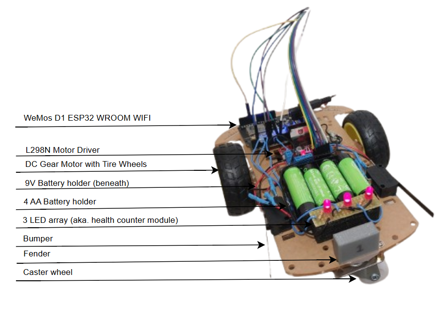
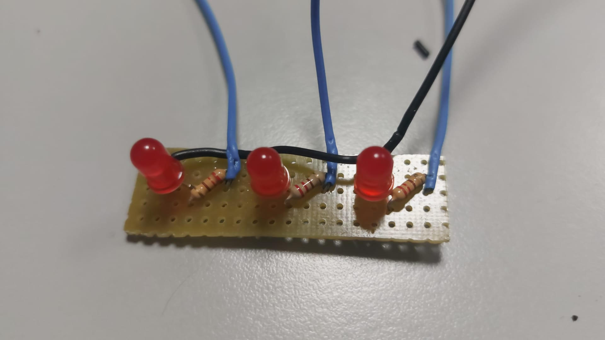

# Bumping Cars

## Disclaimer

The information displayed here is provided as is, you are using it at your own risk. Under no circumstances shall the author be liable for any kind of damages resulting from the use, misuse or inability to use of this code and information even though if the author had previously adivied of the possibility of such damages.

## Summary

The main purpose of this project is to develop a bumping car robot for the _I Jornadas del <a href="https://crm-uam.github.io/">Club de Robótica y Mecatrónica</a>_ and other events in which these robots may be used as a fun activity for the attendees.

These robots are based on ESP32 and use bumpers to manage the bumping mechanic of the game, as well as an array of 3 leds to manage their health counters. The <a href="https://bluepad32.readthedocs.io/en/latest/">Bluepad32 library</a> has been used communicate both the robot and the controller. 

## Components

- WeMos D1 ESP32 WROOM WiFi
- L298n Motor Driver
- DC Gear Motor with Tire Wheels. Gear rate 1:48. 240 rpm.
- 2 bumpers
- 9V battery holder + battery (Connected to board)
- 4 AA battery holder + 4 AA batteries (Connected to motor driver)
- Caster Wheel
- Methacrylate chassis (The one you get from most motor kits)

Other:

- Various wires
- Soldering tin
- Glue sticks

A repurposed 3D parallelepiped was used as a fender for the the bumping cars, enabling the participants to use it to activate the bumpers in their opponent's robot.

### Circuit

⚠️ Coming Soon! (After Summer holidays, but enjoy these figures in the meantime ☺️)

##### LED Array

## Algorithm 

A very straightforward algorithm was implemented. Each time a bumper is activated, a led in the array will shut down. Once all leds are shut off, the robot will stop moving (aka. it dies).

## Instructions of use

Connect the batteries to the robot and place it on the floor. Afterwards, pair the controller to the robot as per your controller's instructions. 
